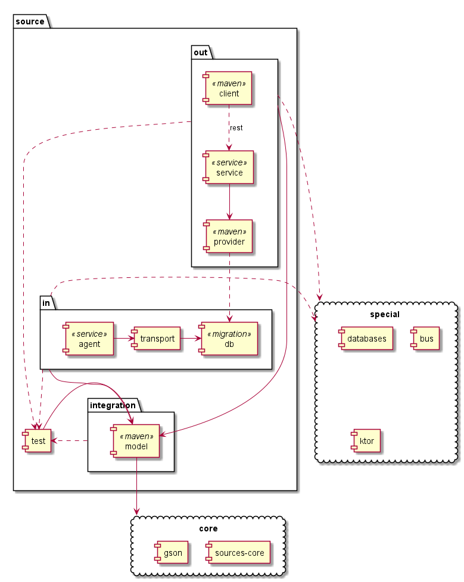

# Шаблон для создания источников

Шаблон предназначен для создания библиотек для источников.

Идеология шаблона - 

1. максимальная централизация всех сведений и алогоритмов, связанных
с конкретным источником 
2. минимизацией зоны покрытия, необходимой при интеграци с источником
3. обеспечение автономных служб для развертывания

## Бутстрап

После клонирования:

1. Выполнить в консоли `./upbuilder` (обеспечит применение последней версии билдера) - эту операцию можно проводить в принципе регулярно
2. Открыть файл `source.json` и настроить в нем поля (делать осмысленно, потом переделывать будет сложно) 
   1. `code`, желательно чтобы совпадало с именем репозитория - будет использоваться как код источника в URL и именах пакетов JAVA
   2. `name`, читаемое имя источника 
3. Выполнить `gradle setup-source`
4. После этого будет настроена структура проекта в части папок кода и будет сформирован README.md

## Структура и назначение модулей

Сводка:

|Модуль|Название|Назначение|Публикация|Зависимости|Примечание|
|-----|-----|-----|-----|-----|-----|
|`model`|Модель|Классы данных, интерфейсы|`maven`|сам ни от чего не зависит, от него все зависит||
|`provider`|Поставщик|Обработка запроса, подготовка данных|`maven`|любые|не рекомендуется для использования напрямую извне если есть возможность через `client`|
|`service`|Сервис|REST/BUS-обертка над `provider`|`docker`|любые|должен работать и в продуктивном и тестовом контуре|
|`client`|Удаленный клиент|REST-клиент для `service`|`maven`|только http|используется для интеграции|
|`db`|База данных|Миграции, утилиты для баз|нет|базы данных|используется если источник имеет свое хранение|
|`transport`|Транспортировка|ETL, прокачки, конвертеры, обвязки сырых данных|нет|любые|используется если есть свое хранение и требуется прокачка|
|`agent`|Агент|REST/BUS- обертка над `transport`|`docker`|любые|используется если нужна служба для прокачки|
|`test`|Тесты|Библиотека поддержки тестов|нет|от него все зависит в зоне `test`||

# Общие тестовые утилиты (test)

Сюда помещаются какие-то общие тестовые классы, нужные в вашем модуле.

"Видит" `model` в зоне `compile`

При этом сам `model` и все остальные модули видят его в `testCompile`

# Модель

Модель предназначена для хранения общих **классов данных** и **интерфейсов** источника

## Правила этого модуля

1. **Не может** зависить ни от чего кроме библиотек, относящихся к `core` системы и легальных общих внешних зависимостей.
> TODO: утвердить список разрешенных библиотек и добавить их в зависимисти

2. **Должен** содержать определения всех `data class`, участвующих в работе источника на всех уровнях, исключение могут 
составлять только модели `transport`, `provider`, использующиеся только внутри этих библиотек и нигде не использующиеся 
снаружи

3. **Должен** содержать в себе средства сериализации определенных моделей, как минимум в JSON и из JSON

4. **Рекомендован** максимальное использование моделей и штатных средств из `core` и перенос их в `core` 
после стабилизации

5. **Рекомендовано** включение всех интерфейсов в этот модуль (даже интернальных), кроме тех которые в сигнатуре 
тянут зависимости не от `core`

6. **Рекомендовано** устанавливать аннотации для JSON схем и их генерация